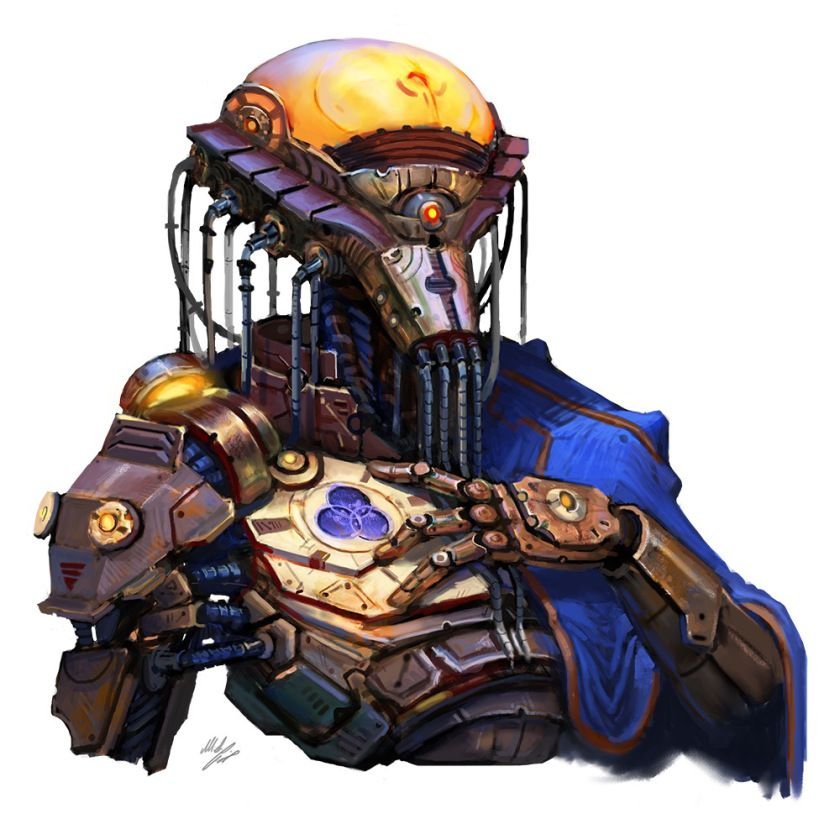

"48" (Sooters  | Factory 48 | Omitrog Plant AG) 

TLDR: "Your neighbours are killbots? mhmm mhmm, and they havent caused you any trouble so far? mhmm mhmm, so whats the issue? Oh you got a dog thats nice -br- Oh right i see"

- A mega factory to rival the vesk industrial hives, the automated sections in the center are a treasure trove

## Culture: 

48's unique setup is one of extreme decentralisation, the factory segments that are liveable without constant threat are home to tinkerers, engineers and general industrialists. With the birth of the technological all father (triune) some sections have become more spiritual over functional, large cults to triune are in contact with "representatives" of the factory, AI constructs that each aim to outproduce one another.

Steel, iron and concrete blot the skyline of 48, many drones and automated logistical system pass through living quarters and "dark zones" alike, the city is always producing something. The titanic industry here is perfect for those looking for expensive goods, hard to produce micro-projects and AI creations, be warned - the dark zone carries this nomenclature for a reason.

## Notable Jobs

Unlike To-D, the main factions are here are beholden to the AIs that actually produce the goods from the factory, as long as they enhance the productivity they are allowed to stay. This raises a few questions for new adventurers
- The cults to triune are always in search of magical and technological products that can enhance the factories, to better meld with their AI landlords
- The tinkerers guild is known to hire people to test weaponry in the dark zones, all factions are looking for persons interested in shrinking the dark zone where possible
- The AIs of 48 care about their employees, food security is relatively poor in 48 and so is physical security against rogue AIs or competing AIs, there is always a job to be had to maximize production

