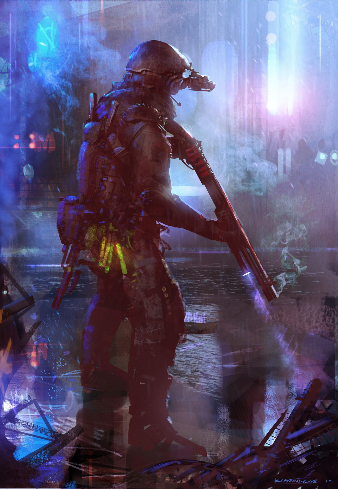

Cy_ (The underscore is optional)

TLDR: "They thought a megacity, built around a highly -[REDACTED]- object was a good idea, turned out its great for the finance sector!"

- OverTheTop Cyberpunk grunge city, the tech is a bit more Net and Corporation focused, but the credits flow more free-ly in the city of vice

## Culture: 

Cy_ is renowned in Vezen for its status as "the place money goes to die", high rises are contrasted with slums, The banking sector is opposite massive steelworks that house all kinds of punks and denizens, the city is truly a playground for the megacorps. 

The many rivers and roads that flow through the city make it a perfect end node for trade, the city is somehow stylized more like a dystopian novel than any actual city in the pact worlds. Many different cliques and groups live, work and die here, for outsiders the money flows freely where morals do not, and the appeal of becoming a modern legend through "NetCasts" or in one of the many "DataStream(z)" chat boards

## Notable jobs: 

Nascent Ai's, infamous hackers, MegaCorps, cults - you name it, everyone wants to expand their influence and money exists purely to carve out a corner of Cy_

- Shipments of drugs come and go, stealing or securing them for the right party is a sure fire way to earn some quick cash
- Due to its situation as a MegaCorp hub, experimental equiptment can often be found here and sold to the highest bidder, or tested for the right price if you have a good reputation with some Corpo's
- The dire situation has lead to many cults popping up, and some gods have taken notice ...
- DataStream and Net nodes here contain information about the universe "pre gap", with some rumouring that some of the early AIs have stored away "during gap" information in the deepest, darkest layers of the Net

