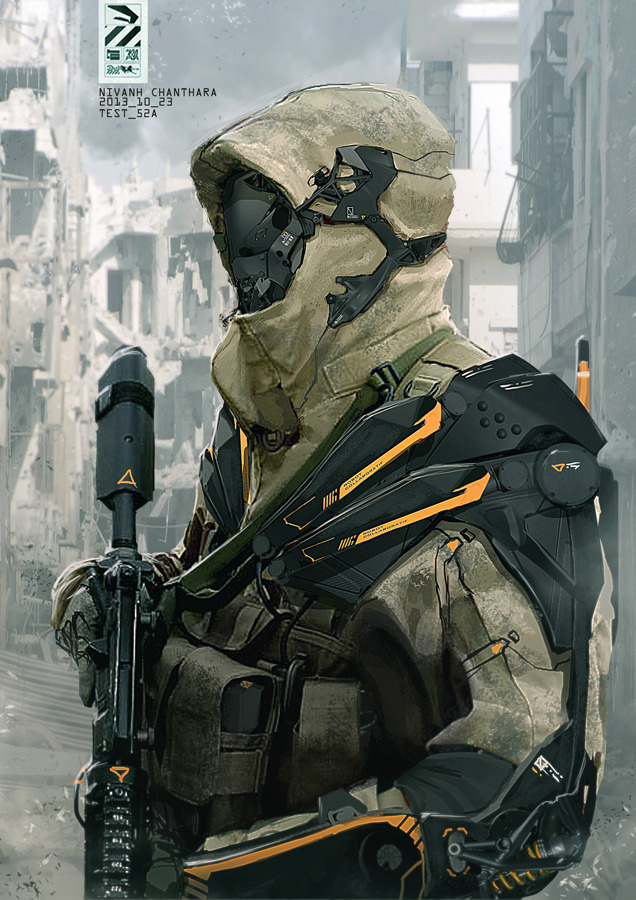
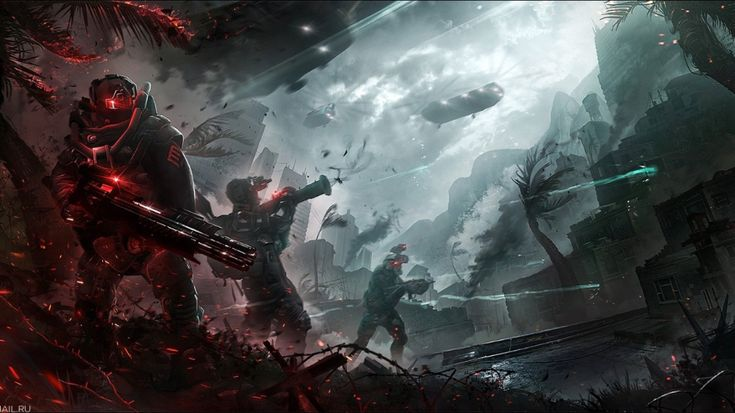

Last Port (Unity of Kahre  | The Unity )

TLDR: "Well the dataslate just says 'Projected Status Null' ... yeh and then a bunch of wierd symbols"

## Culture:

Last port is a known autocratic city on the edge of civilization, not much is known about it according to your dataslates but there is one thing that often show up in the news feeds. The city has been a hotspot for violence, combat and wide civil unrest. The fighting oft-x###é[r]//{}### 
**/+/<<INFORMATION CORRUPTED<</+/**





## Notable Jobs:

With the lack of data, its hard to make a solid estimate on what can be done here

- The local autocratic rules are probably looking for able bodied people to help in the fight
- The non-rules could use some people willing to do wet-work 
- ```^.?$|^(..+?)\1+$```

