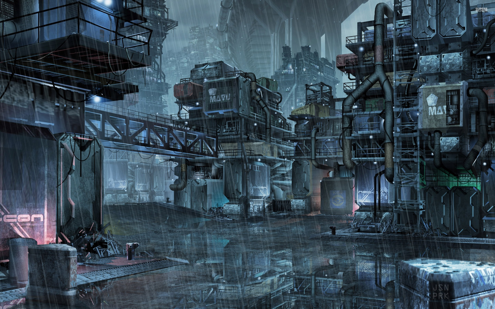

Scrappers (The Yard)

TLDR: "Yeh its a real fixer up, your human neighbours are great though ! Why the emphasis on 'human'?, eh well you'll see"

- The massive junk piles known as "scrappers" are a veritable mountain of debris, refuse and outright trash from orbit. 

## Culture:

The engineers over at To-D designated orbital defenses that would threaten the Space Elevator, decided that Scrappers was a natural groundfall for all the trash in orbit, which historically has lead to the creation of this society of scrappers and survivalists.

## Notable Jobs:

Scrappers attracts many characters, those that want to do something with their hands or make recycling a reverent act are among the most well known.

- Some of the most famous tinkerers are becoming well known from galactic broadcasting shows, some level of hijinks and adventure always leans well into their media income
- Settlements always welcome an expansion to their buffer zone, if youre willing to intrude into the trash's gray zone

