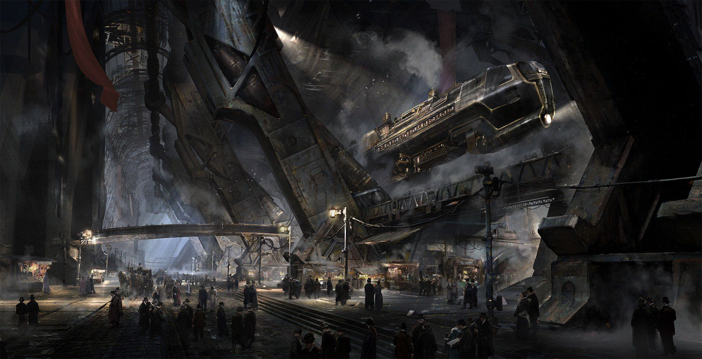
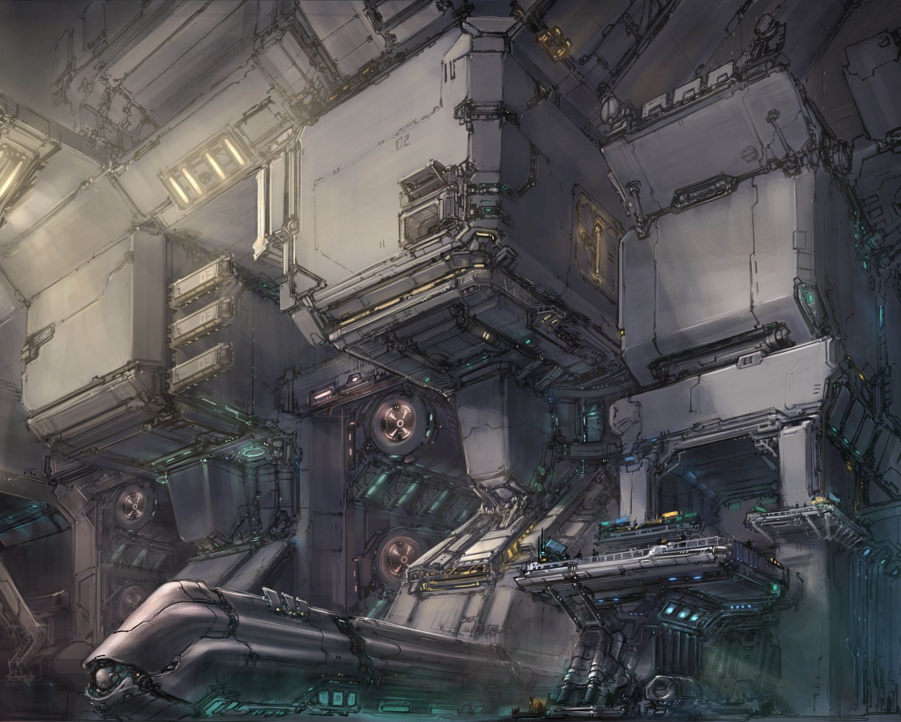

Terminus (Vhalthionget Unity)

TLDR: "The rail isnt that loud, at least iv never noticed it and iv only lived here for 40 years... No i said *40 years* - Ah god darn outsiders, just use your IntPAD :triumph:"

- The hyper relay for ground based transport, maglev trains and ground-hugging airships start here using the speed boost provided by the ancient archeotech colony ships core - a scantly understood technology

## Culture:

Terminus is an enclosed city, its built into the remains of an archeotech ship with the city center being a bustling hub for transportation. The city is often though of as a moving maze, though locals will just tell you each section is going through "the seasons". Each section shifts with the whims of the ship, each person working in Terminus is focused on two things, the safety and timely departure of all outsiders.

## Notable Jobs:

Terminus is always looking for way to keep the planets transport flowing, whatever it takes. There is also often talk of heroes journeying into the forbidden sections.

- The terminus ship core holds many archeotech items in reserve for those that can subdue problems affecting its efficiency matrix, ensuring the free flow of goods will surely gain its attention.
- CyCore and PactPunk items are rare here, journeying outside is often openly encouraged but quietly hindered, retrieving specific items can net some credibility and items
- Travelers, Modularists and Guardians are always looking for hired guns in Terminus, not everyone coming here for speedy travel is doing so to get somewhere but rather to make a getaway

